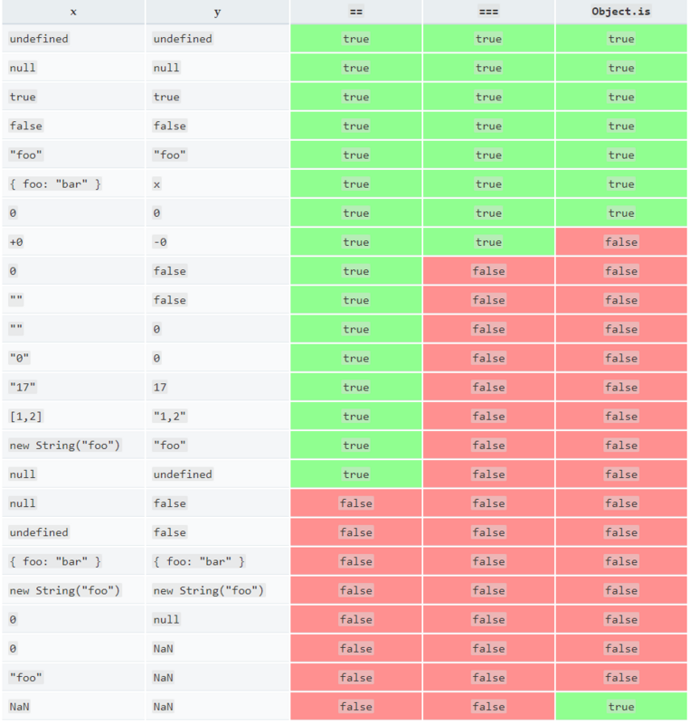

# JavaScript的相等比较(==)和(===)及Object.is()的区别

## 比较运算符之相等运算符

ES5 比较两个值是否相等，只有两个运算符：相等运算符（`==`）和严格相等运算符（`===`）。前者在比较时对于不同数据类型的值会进行类型转换；而后者不会转换，且结果更容易预测，并且因为没有隐式转换，全等比较的运行会更快。因此建议使用严格相等运算符 `===` 进行值的比较。

### 严格相等运算符 ===

#### （1） 不同类型的值比较

如果比较的两个值的类型不同，直接返回 `false`。

```js
1 === "1"        // false
true === "true"  // false
```

#### （2） 原始类型值比较

原始类型值有五种：`undefined`、`null`、布尔值（`Boolean`）、字符串（`String`）、数值（`Number`）。

##### 1. 非数值类型比较

值相同就返回 `true`，值不同就返回 `false`。

```js
null === null        // true
null === undefined   // false
```

##### 2. 数值类型比较

正常情况下值相同就返回 `true`，值不同就返回 `false`。但有两个特殊情况：

**一是：0不分正负**

```js
0 === -0   //true
```

**二是：NaN 本身不全等于任何值。**

```js
NaN === NaN   //false
NaN !== NaN   //true
```

也就是说 **等式 `(x !== x)` 成立的唯一情况是 x 的值为 NaN。**

#### (3) 复合类型值比较

复合类型的值实际上存储的是数据的内存地址，因此两个复合类型（对象、数组、函数）的数据比较时，不是比较它们的值是否相等，而是比较它们是否指向同一个地址。

```js
{} === {}                           // false
[] === []                           // false
(function () {} === function () {}) // false
```

上面代码分别比较两个空对象、两个空数组、两个空函数，结果都是不相等。那是因为空对象、空数组、空函数的值，都存放在不同的内存地址，因此结果是 `false`。

而如果两个变量引用同一个对象，那它们则相等，因为它们引用的对象存储在同一个内存地址。

```js
var v1 = {};
var v2 = v1;
v1 === v2      // true
```

### 相等运算符 ==

相等运算符用来比较相同类型的数据以及复合类型数据时，与严格相等运算符完全一样。比较不同类型的数据时，相等运算符会先将数据进行类型转换，然后再用严格相等运算符比较。

#### （1） 原始类型值比较

原始类型的值会转换成数值再进行比较。转换规则是使用 `Number()` 转换。

```js
1 == true            // true    等同于 1 === Number(true)
0 == false           // true    等同于 0 === Number(false)
'true' == true       // false   等同于 Number('true') === Number(true)
'' == 0              // true    等同于 Number('') === 0
'' == false          // true    等同于 0 === 0
'\n  123  \t' == 123 // true    因为字符串转为数字时，省略前置和后置的空格
```

#### （2） undefined 和 null

`undefined` 和 `null` 与其他类型的值比较时，结果都为 `false`，它们互相比较时结果为 `true`。

```js
false == null          // false
false == undefined     // false
0 == null              // false
0 == undefined         // false
NaN == undefined       // false
undefined == null      // true
```

#### （3） 对象与原始类型值比较

对象（这里指广义的对象，包括数组和函数）与原始类型的值比较时，对象转换成原始类型的值，再进行比较。

##### 1. 对象与数值比较时，对象转为数值 Number()

```js
[1] == 1  // true  等同于 Number([1]) == 1
```

##### 2. 对象与字符串比较时，对象转为字符串 String()

```js
[1] == '1'       // true  等同于 String([1]) == '1'
[1, 2] == '1,2'  // true  等同于 String([1, 2]) == '1,2'
```

##### 3. 对象与布尔值比较时，两边都转为数值

```js
[1] == true    // true   等同于 Number([1]) == Number(true)
[2] == true    // false  等同于 Number([2]) == Number(true)
```

类型转换参考[数据类型的强制转换和隐式转换](https://segmentfault.com/a/1190000021106485)

## Object.is(value1, value2)

相等运算符（`==`）和严格相等运算符（`===`）都有缺点，前者会自动转换数据类型，后者的 `NaN` 不等于自身，以及 `+0` 等于 `-0`。因此 ES6 的新方法 `Object.is()` 可以用来解决这个问题。

`Object.is()` 用来比较两个值是否严格相等，与严格比较运算符（`===`）的行为基本一致。返回布尔值，相等返回 `true`，不相等返回 `false`。

**不同之处只有两个：一是 +0 不等于 -0，二是 NaN 等于自身。**

```js
+0 === -0              //true
NaN === NaN            // false

Object.is(+0, -0)      // false
Object.is(NaN, NaN)    // true
```

对于不兼容 ES6 的浏览器，可以在 ES5 环境下通过下面的代码，部署 `Object.is()`。

```js
Object.defineProperty(Object, 'is', {
  value: function(x, y) {
    if (x === y) {
      // 针对+0 不等于 -0的情况
      return x !== 0 || 1 / x === 1 / y;
    }
    // 针对NaN的情况
    return x !== x && y !== y;
  },
  configurable: true,
  enumerable: false,
  writable: true
});
```

*判断相等一览表*

