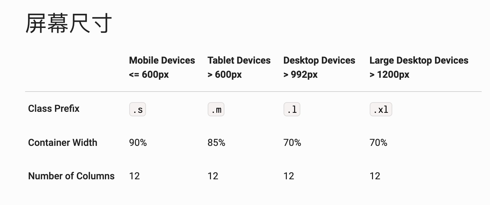
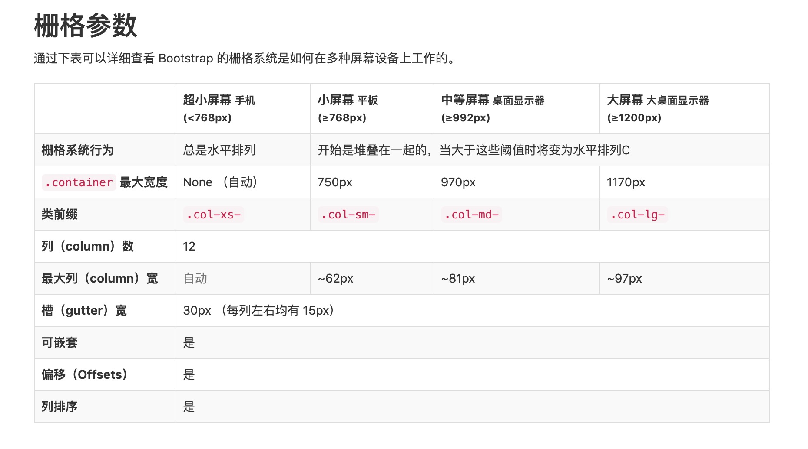
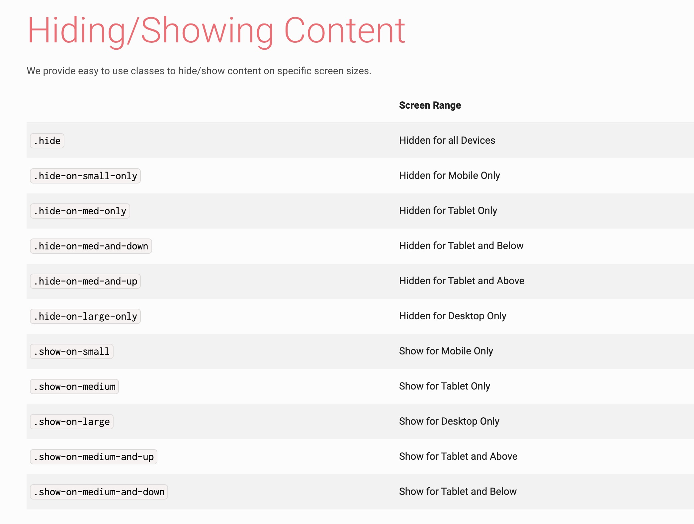
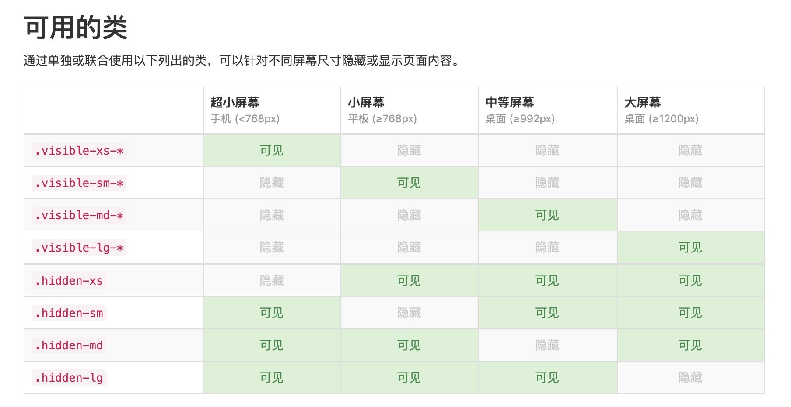

## Material Design 在 web 端的使用

[Material Design官方](https://www.material.io/develop/)提供了三种平台（IOS、Android、WEB）以及 Flutter 的使用文档。在此主要说明 web 端的使用。

### 使用 CDN 初识 Material Design

首先引入 css 和 js 文件：

```html
<head>
  <link href="https://unpkg.com/material-components-web@latest/dist/material-components-web.min.css" rel="stylesheet">
  <script src="https://unpkg.com/material-components-web@latest/dist/material-components-web.min.js"></script>
</head>
```

并且推荐使用  Material Icons 。

```html
<head>
  <link rel="stylesheet" href="https://fonts.googleapis.com/icon?family=Material+Icons">
</head>
```

这样就完成了资源的引入，接下来可直接在 html 中使用组件。

#### Button 组件

使用详情可参考 [官方开发文档](https://material.io/develop/web/components/buttons/)

1. 基础使用

```html
<button class="mdc-button">Button</button>
```

2. 用户也可直接给 `a` 标签添加 `mdc-button` class 名，可达成一样的效果。

```html
<a class="mdc-button" href="">跳转</a>
```

3. 可通过添加 `mdc-button--unelevated` class名实现实心的按钮。

```html
<button class="mdc-button mdc-button--unelevated">取消</button>
```

4. 给 button 标签添加海拔高度，可通过添加class名 `mdc-button--raised`。

```html
<button class="mdc-button mdc-button--raised">确认</button>
```

5. 添加 `mdc-button--outlined` class 名，可给按钮加边框。

```html
<button class="mdc-button mdc-button--outlined">购买</button>
```

6. 也可给按钮加图标

```html
<button class="mdc-button mdc-button--outlined">
  <i class="material-icons mdc-button__icon" aria-hidden="true">favorite</i>
  <span class="mdc-button__label">Button</span>
</button>
```

7. 按钮的禁用状态，直接给 button 添加 disabled 属性即可。

```html
<button class="mdc-button" disabled>
  <span class="mdc-button__label">Button</span>
</button>
```

## 一些常用的 Material Design 风格的前端库

- [Materialize](https://materializecss.com/)：基于 Material Design 的现代响应式前端框架
- [MUI](https://www.muicss.com/)：一个轻量级的 CSS 框架，遵循 Google 的 Material Design 设计方针
- [Vuetify](https://vuetifyjs.com/zh-Hans/)：让 Vue 和 Material Design 的强大力量在开发上助您一臂之力
- [Material-UI](https://material-ui.com/zh/)：世界上最受欢迎的 React UI 框架。
- [LumX](http://ui.lumapps.com/)：LumX is the first responsive front-end framework based on AngularJS & Google Material Design specifications.
- ......


## 栅格系统的响应式布局

- [materialize](http://archives.materializecss.com/0.100.2/grid.html)
- [bootstrap](https://v3.bootcss.com/css/#grid)

### 规则

- 先有行（row），再有列（columcolumn），因为需要通过行（row）在水平方向创建一组列（column）。
- 标准的每一行有12列。 无论浏览器的大小，每一列的宽度总是相等的。
- 内容应当放置于“列（column）”内，并且，只有“列（column）”可以作为行（row）”的直接子元素。
- 如果一“行（row）”中包含的“列（column）”大于 12，多余的“列（column）”所在的元素将被作为一个整体另起一行排列。

```html
<!-- materialize -->
<div class="row">
  <div class="col s1">1</div>
  <div class="col s1">2</div>
  <div class="col s1">3</div>
  <div class="col s1">4</div>
  <div class="col s1">5</div>
  <div class="col s1">6</div>
  <div class="col s1">7</div>
  <div class="col s1">8</div>
  <div class="col s1">9</div>
  <div class="col s1">10</div>
  <div class="col s1">11</div>
  <div class="col s1">12</div>
</div>
```

```html
<!-- bootstrap -->
<div class="row">
  <div class="col-xs-1">.col-xs-1</div>
  <div class="col-xs-1">.col-xs-1</div>
  <div class="col-xs-1">.col-xs-1</div>
  <div class="col-xs-1">.col-xs-1</div>
  <div class="col-xs-1">.col-xs-1</div>
  <div class="col-xs-1">.col-xs-1</div>
  <div class="col-xs-1">.col-xs-1</div>
  <div class="col-xs-1">.col-xs-1</div>
  <div class="col-xs-1">.col-xs-1</div>
  <div class="col-xs-1">.col-xs-1</div>
  <div class="col-xs-1">.col-xs-1</div>
  <div class="col-xs-1">.col-xs-1</div>
</div>
```

### 栅格参数

通过栅格参数可以详细查看各框架的栅格系统是如何在多种屏幕设备上工作的。



上图为 materialize 的响应式布局参数。只要在相应的列（column）上添加对应的 class 即可，比如 `col s12 m6` 表示在小屏上是全宽，在中屏上是一半宽度。

```html
<!-- materialize -->
<div class="row">
  <div class="col s12 m4 l3"></div>
  <div class="col s12 m8 l9"></div>
</div>
```

下图为 bootstrap 的参数，class 前缀与 materialize 有些不同。比如小屏上全宽，中屏一半宽的 class 名是 `col-xs-12 col-md-6`。



```html
<!-- bootstrap -->
<div class="row">
  <div class="col-xs-12 col-md-8">.col-xs-12 .col-md-8</div>
  <div class="col-xs-6 col-md-4">.col-xs-6 .col-md-4</div>
</div>
```

### 可见（show）与不可见（hide）

通过单独或联合使用以下列出的类，可以针对不同屏幕尺寸隐藏或显示页面内容。

下图是 materialize 的 class 名设置。



下图是 bootstrap 的 class 名设置。



### 原理 @media 媒体查询

实现不同大小屏幕表现形式不同的原理就是 CSS3 的 @media 媒体查询。

**作用**：使用 @media 查询，可以针对不同的媒体类型以及不同的屏幕尺寸来定义不同的样式。

**语法**

1. css样式表

    ```html
    <style>
      @media not|only [mediatype] and (media feature) {
          CSS-Code;
      }
    </style>
    ```

2. link 外链

    ```html
    <link rel="stylesheet" media="(max-width: 800px)" href="example.css" />
    ```

**逻辑操作符**

逻辑操作符不是必须要写的，但若使用了 `not` 或 `only` 操作符，必须明确指定一个媒体类型。

- and：and 操作符用来把多个媒体属性组合成一条媒体查询。
    ```css
    @media (min-width: 700px) and (orientation: landscape) { 
      <!-- 可视区域宽度不小于700像素并在横屏时有效 -->
    }
    ```
- not：not 操作符用来对一整条媒体查询的结果进行取反。
- only：only 操作符仅在媒体查询匹配成功的情况下被用于应用一个样式

**mediatype 媒体类型**

媒体类型是可选的，默认值是all(全部).

- `all`：用于所有设备（默认）。
- `screen`：用于电脑屏幕，平板电脑，智能手机等。
- `print`：用于打印机和打印预览。
- `speech`：用于屏幕阅读器等发声设备。

**media feature 媒体特征**

有很多可选项，这里之列出常用的几个。

- max-width：定义输出设备中的页面最大可见区域宽度。
- min-width：定义输出设备中的页面最小可见区域宽度。
- max-height：定义输出设备中的页面最大可见区域高度。
- min-height：定义输出设备中的页面最小可见区域高度。
- orientation：指定了设备处于横屏 `landscape`（宽度大于高度）模式还是竖屏 `portrait`（高度大于宽度）模式。

**示例**

```css
@media only screen and (max-width: 500px) and (orientation: landscape) {
  body {
    background-color:lightblue;
  }
}
```

**学习参考链接**：
- [CSS媒体查询-MDN](https://developer.mozilla.org/zh-CN/docs/Web/Guide/CSS/Media_queries)
- [CSS3 @media 查询-菜鸟教程](https://www.runoob.com/cssref/css3-pr-mediaquery.html)
