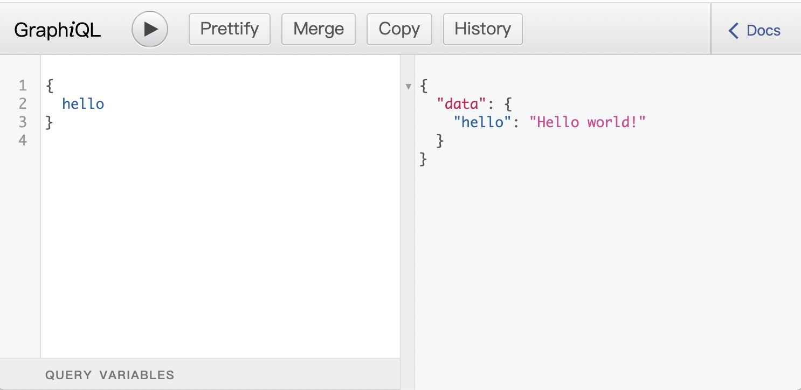

## graphql.js

安装

```shell
npm install graphql --save
```

一个 GraphQL 服务需要一个定义 `Query` 类型的 `schema` 来处理 GraphQL 查询。还需要一个 API 根节点，为每个 API 字段提供 `resolver` 函数。

```js
// server.js
const { graphql, buildSchema } = require('graphql');

// 使用 GraphQL schema language 构建一个 schema
const schema = buildSchema(`
  type Query {
    hello: String
  }
`);

// 根节点，为每个 API 入口字段提供 resolver 函数
const root = {
  hello: () => { return 'Hello world!'; },
};

// 运行 GraphQL 的 query 查询 '{ hello }' ，输出响应
graphql(schema, '{ hello }', root).then((response) => {
  console.log(response);
});
```

在 node 中执行该文件，获得结果：

```shell
$ node server.js
{ data: { hello: 'Hello world!' } }
```

然而，在实际应用中，肯定不会在命令行工具里执行 GraphQL，而是会从一个 API 服务器运行 GraphQL 查询。要通过 HTTP 将 GraphQL 用于 API 服务器，就需要配合服务端实现。

## express + express-graphql + graphql

安装

```shell
npm install express express-graphql graphql --save
```

使用 express 模块来运行一个服务器，然后不再直接调用 `graphql()` 函数进行查询，而是使用 `express-graphql` 库来构建 GraphQL API 服务器，响应入口端点为 `/graphql` 的 HTTP 请求。

```js
// server.js
const express = require('express');
const graphqlHTTP = require('express-graphql');
const { buildSchema } = require('graphql');

// 使用 GraphQL Schema Language 创建一个 schema
const schema = buildSchema(`
  type Query {
    hello: String
  }
`);

// root 提供所有 API 入口字段相应的解析器函数
const root = {
  hello: () => { return 'Hello world!'; },
};

const app = express();
app.use('/graphql', graphqlHTTP({
  schema: schema,
  rootValue: root,
  graphiql: true,
}));
app.listen(4000);
console.log('Running a GraphQL API server at http://localhost:4000/graphql');
```

由于对 `graphqlHTTP` 设置 `graphiql: true`，表示可以使用 GraphiQL 工具来手动执行 GraphQL 查询。因此启动服务 `node server.js` 之后，打开 <http://localhost:4000/graphql>，即可看到一个可输入查询语句的可视化界面。



### 客户端请求获取数据

在有了 `express-graphql` 的情况下，可以向 GraphQL 服务器上的入口端点发送一个 HTTP POST 请求，其中将 GraphQL 的 query 查询作为 JSON 形式的 `query` 字段的属性值，就能调用 GraphQL 服务器。

```js
fetch('/graphql', {
  method: 'POST',
  headers: {
    'Content-Type': 'application/json',
    'Accept': 'application/json',
  },
  body: JSON.stringify({query: "{ hello }"})
})
  .then(r => r.json())
  .then(data => console.log('data returned:', data));

// data returned: Object { hello: "Hello world!" }
```

## GraphQLSchema 构建 Schema

使用 `GraphQLSchema` 构造函数创建 Schema 时，不需要使用 `type` 关键字定义 `Query` 和 `Mutation` 类型，而是需要像创建对象一样用 `GraphQLObjectType` 构造函数创建类型。

```js
const {GraphQLObjectType, GraphQLSchema, GraphQLString} = require('graphql');

// 定义 User 类型
const userType = new GraphQLObjectType({
  name: 'User',
  fields: {
    name: {
      type: GraphQLString,
      args: {
        name: { 
          type: GraphQLString,
          defaultValue: 'Dora'
        }
      },
      resolve: (parentValue, args, request)=> {  // 
        console.log(parentValue)  // { name: '', age: '15' }
        return args.name
      }
    },
    age: {
      type: GraphQLString,
    }
  }
});

// 定义 Query 类型
const queryType = new GraphQLObjectType({
  name: 'Query',
  fields: {
    author: {
      type: userType,
      resolve: ()=> {
        return {
          name: '',
          age: '15'
        };
      }
    },
  }
});

const schema = new GraphQLSchema({query: queryType});
```

注意，解析器函数提供 source（父类型 return 的值）对象作为第一个参数。但是，如果未提供解析器函数，则将在 source 中查找与该字段名称相同的方法来作为默认的解析器。如果找到，则使用 (args, context, info) 调用该方法。

也就是说，resolve 解析器的函数第一个参数永远都是父类型 return 的值，第二个参数才是前端传的变量；而字段函数的第一个参数就是前端传过来的变量。


*参考链接*

- [GraphQL.js 教程](https://graphql.cn/graphql-js/)

- [GraphQL - 中文网](https://graphql.cn/)
